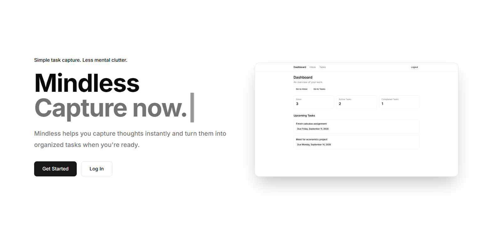
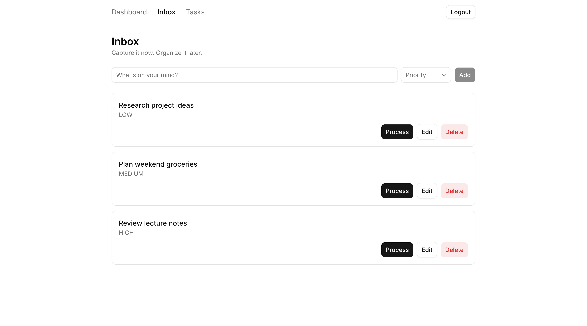
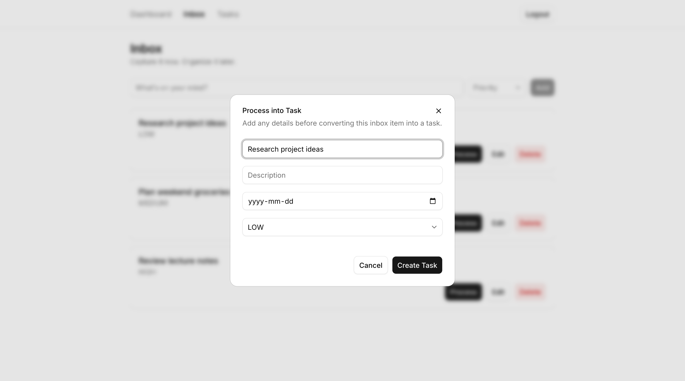
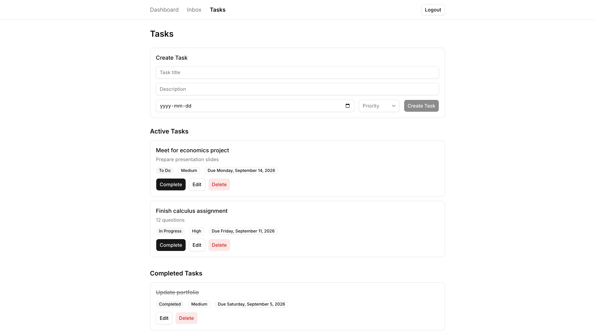

# Mindless

Mindless is a full-stack personal productivity app built for quickly capturing thoughts, reminders, and tasks before organizing them into actionable work.

The idea is simple: capture something immediately in your Inbox, then process it into a structured task when you're ready.

## Preview



<details>
<summary><strong>View more screenshots</strong></summary>

<br>

### Inbox



### Process Inbox Item



### Tasks



</details>

## Features

### Authentication
- Create an account
- Automatic login after registration
- Login and logout
- Session-based authentication
- HTTP-only session cookies
- Protected application routes

### Inbox
- Quickly capture items
- Assign optional priorities
- Edit Inbox items
- Delete Inbox items
- Process Inbox items into Tasks

### Tasks
- Create tasks directly
- Add descriptions
- Set due dates
- Assign priorities
- Track task status
- Edit tasks
- Complete tasks
- Delete tasks
- Separate active and completed tasks

### Dashboard
- View Inbox item count
- View active task count
- View completed task count
- See upcoming tasks
- Quickly navigate to Inbox and Tasks

### UI
- Responsive desktop and mobile layouts
- Loading and empty states
- Form validation
- Consistent task status and priority badges
- Readable due-date formatting

## Tech Stack

### Frontend
- Next.js
- React
- TypeScript
- Tailwind CSS
- shadcn/ui

### Backend
- Node.js
- Express
- TypeScript
- Prisma

### Database
- PostgreSQL
- Neon

### Deployment
- Vercel — frontend
- Render — backend
- Neon — PostgreSQL database

## Architecture

Mindless uses a separate frontend and backend architecture:

```text
Next.js Frontend
       ↓
   REST API
       ↓
Express Backend
       ↓
   Prisma ORM
       ↓
Neon PostgreSQL
```

The frontend communicates with the Express backend through HTTP requests.

The backend handles authentication, validation, application logic, and database access.

Prisma provides the database access layer between the Express application and PostgreSQL.

## Authentication

Mindless uses custom session-based authentication.

When a user logs in or creates an account:

1. The backend verifies or creates the user.
2. A session is created and stored in the database.
3. A session token is sent to the browser using an HTTP-only cookie.
4. Protected backend routes verify the session before allowing access.

Passwords are hashed before being stored in the database.

## Project Structure

```text
mindless/
├── backend/
│   ├── prisma/
│   ├── src/
│   │   ├── controllers/
│   │   ├── db/
│   │   ├── middleware/
│   │   ├── routes/
│   │   ├── services/
│   │   ├── app.ts
│   │   └── index.ts
│   ├── package.json
│   └── tsconfig.json
│
├── frontend/
│   ├── app/
│   │   ├── (authenticated)/
│   │   │   ├── dashboard/
│   │   │   ├── inbox/
│   │   │   └── tasks/
│   │   ├── login/
│   │   └── signup/
│   ├── components/
│   ├── lib/
│   └── package.json
│
└── README.md
```

## Running Locally

### Prerequisites

Make sure you have:

- Node.js
- npm
- A PostgreSQL database

### 1. Clone the repository

```bash
git clone https://github.com/alex-rb1/mindless.git
cd mindless
```

### 2. Set up the backend

```bash
cd backend
npm install
```

Create a `.env` file inside `backend/`:

```env
DATABASE_URL=your_postgresql_connection_string
FRONTEND_URL=http://localhost:3000
```

Generate the Prisma client:

```bash
npx prisma generate
```

Run the backend:

```bash
npm run dev
```

The backend will run at:

```text
http://localhost:4000
```

You can verify it using:

```text
http://localhost:4000/health
```

### 3. Set up the frontend

Open another terminal:

```bash
cd frontend
npm install
```

Create:

```text
frontend/.env.local
```

Add:

```env
NEXT_PUBLIC_API_URL=http://localhost:4000
```

Run the frontend:

```bash
npm run dev
```

The frontend will run at:

```text
http://localhost:3000
```

## Production Build

### Backend

Build the TypeScript backend:

```bash
npm run build
```

Start the production server:

```bash
npm start
```

The backend uses the platform-provided `PORT` environment variable in production and falls back to port `4000` locally.

### Frontend

Build the Next.js application:

```bash
npm run build
```

Start it:

```bash
npm start
```

## Environment Variables

### Backend

```env
DATABASE_URL=your_postgresql_connection_string
FRONTEND_URL=your_frontend_url
NODE_ENV=production
```

### Frontend

```env
NEXT_PUBLIC_API_URL=your_backend_url
```

Do not commit `.env` or `.env.local` files containing credentials or secrets.

## Deployment

Mindless is deployed using:

```text
Vercel
   ↓
Next.js Frontend
   ↓
Render
   ↓
Express API
   ↓
Neon
   ↓
PostgreSQL
```

Production environment variables are configured directly through the respective hosting platforms.

## Core User Flow

```text
Create Account
      ↓
Dashboard
      ↓
Capture Inbox Item
      ↓
Process Item
      ↓
Create Task
      ↓
Manage Task
      ↓
Complete Task
```

Users can also bypass the Inbox and create tasks directly from the Tasks page.

## API Overview

### Authentication

```text
POST /auth/register
POST /auth/login
POST /auth/logout
GET  /auth/me
```

### Inbox

```text
GET    /inbox
POST   /inbox
PATCH  /inbox/:id
DELETE /inbox/:id
```

### Tasks

```text
GET    /tasks
POST   /tasks
PATCH  /tasks/:id
DELETE /tasks/:id
POST   /tasks/process/:id
```

Protected routes require a valid authenticated session.

## Security

Mindless includes several basic security measures:

- Password hashing
- HTTP-only authentication cookies
- Secure cookies in production
- SameSite cookie configuration
- CORS restrictions
- Server-side authentication
- Resource ownership checks
- Backend input validation
- Environment variables for sensitive configuration

## Status

**Mindless v1 MVP is complete and deployed.**

The current version supports the complete workflow from account creation through capturing, organizing, managing, and completing tasks.

## Future Improvements

Potential future additions include:

- Task search and filtering
- Tags and categories
- Recurring tasks
- Notifications and reminders
- Improved dashboard analytics
- Drag-and-drop organization
- Keyboard shortcuts
- Dark mode
- Automated testing
- Additional productivity workflows